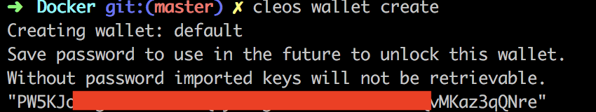
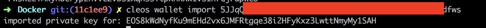
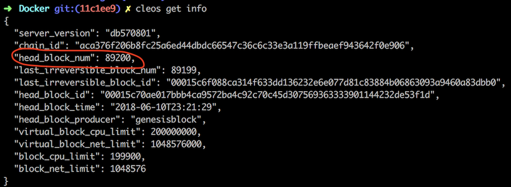
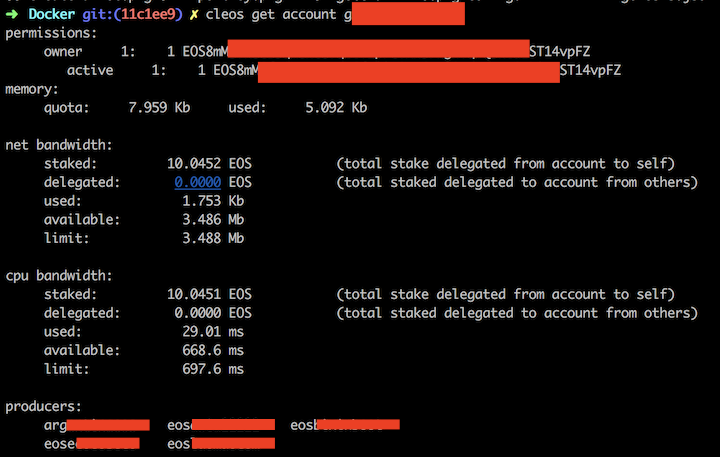

## How To Vote
* Open your terminal and cd your workspace

* Run `git clone https://github.com/EOSLaoMao/eos-full-node.git && cd ./eos-full-node`

* Run container `./run-docker.sh && docker ps`

* Excute command `alias cleos="docker exec full-node cleos"` on your current tty, or add this command to .bashrc or other shell rc file and source it.

* Create Wallet: `cleos wallet create`. Please save your wallet password in a security place. Please note: wallet will be auto locked by keosd after 15 minutes of inactivity. Use `cleos wallet unlock --password=[walletPassword]` to unlock it.

* Import key: `cleos wallet import [privateKey]`

* Get blockchain status: `cleos get info` 

* Wait head block number reach the latest. https://explorer.eoseco.com/

* Get account info: `cleos get account [accountName]` to check your account info 
 
* Voting: `cleos system voteproducer prods [accountName] [bpNameList]`
e.g:`cleos system voterproducer prods xxxxxx eoslaomacom eosbixinboot`

* Check voting staus: `cleos get account [accountName] ` to check voting status

